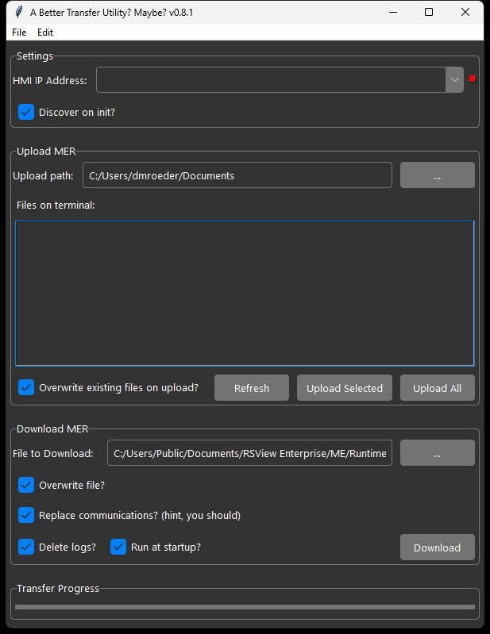

# pymeu_gui
GUI front end for the Python ME Transfer Utility

## Features
* Works indpendent of any Rockwell software
* Discover all PanelView Plus terminals on the network
* Easily select a PanelView by IP address
* Upload one MER or upload all files
* Doesn't have the EDS subsystem, so all you need is the IP address
* Supports backplane path routing
* Verifies MER version is the same or older than terminal firmware
* Alerts if MER is protected
* Delete MER from PanelView

## Acknowledgements
* **aawilliams85** for the excellent pymeu utility [aawilliams85](https://github.com/aawilliams85)
* **rdbende** for the sweet theme [rdbende](https://github.com/rdbende/Azure-ttk-theme)
